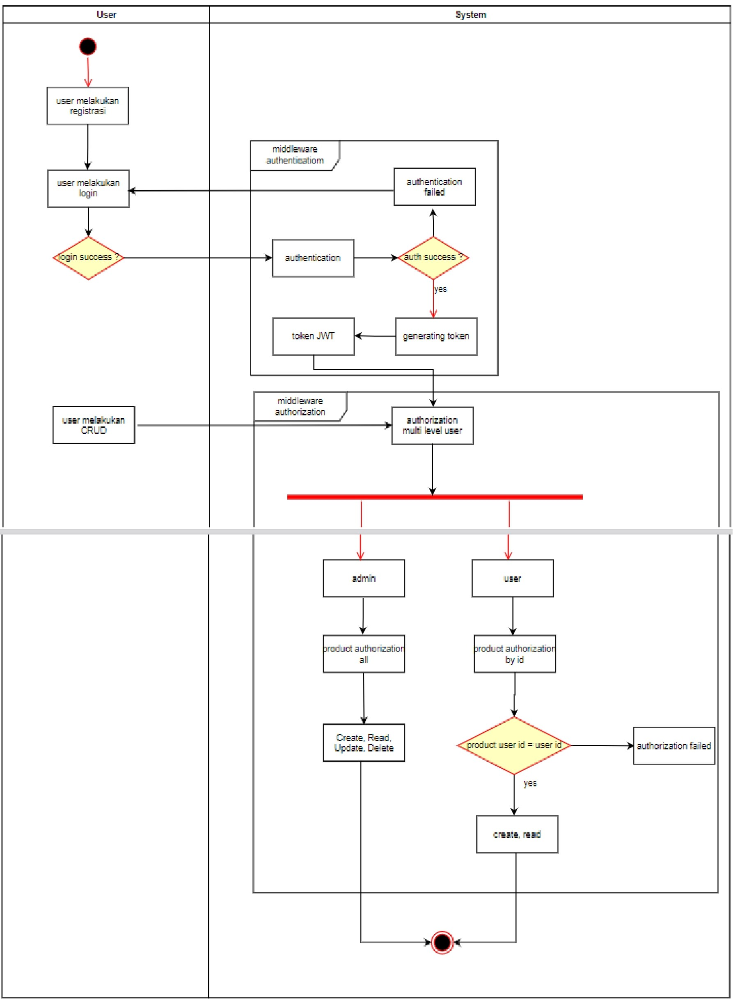

# Challange 8 (chapter 3 sesi 2)

This is a program for add a product with user authentication and authorization.

## Diagram Activity
Here the Diagram Activity:

## Run Program
How to run program:

    // Set your .env first
    // after set, just run command below
    `go run main.go`

**For the output**

1. Download this file: [Postman-output](https://github.com/naufal360/go-middleware-challange/assets/Midleware-Challange.postman_collection)
2. Import the postman file to your postman.
3. Expand each folder and request to see the each example output.
